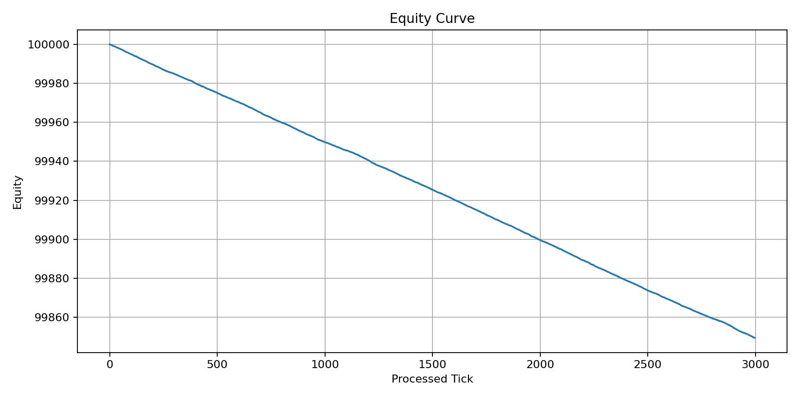
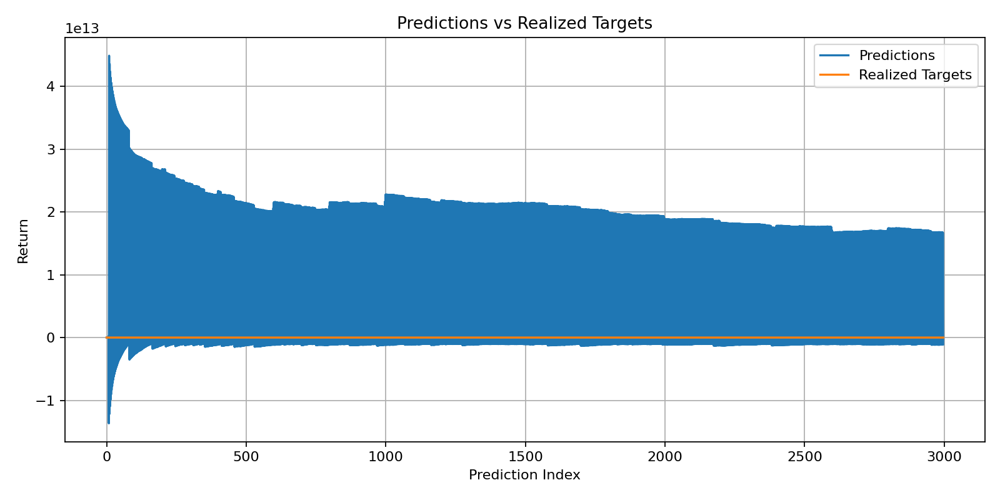
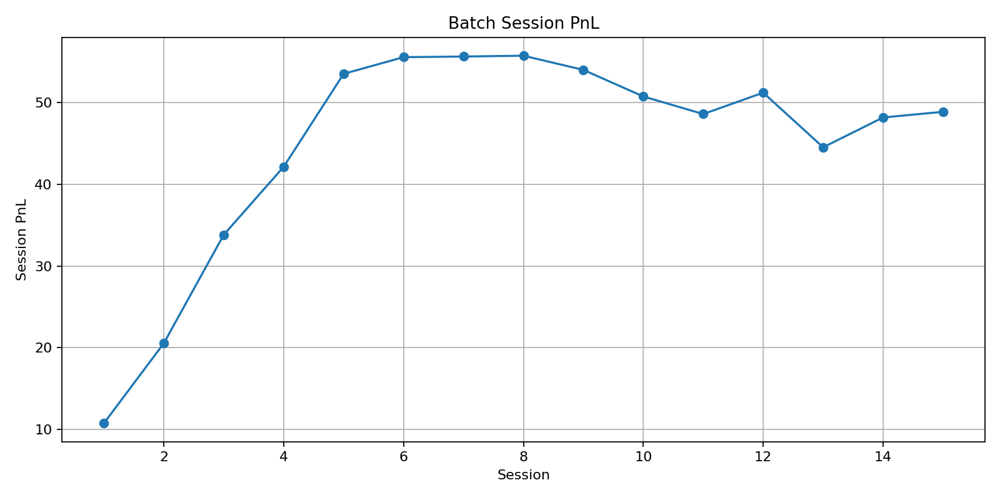

# 🚀 Streaming ML Trading System (Top 1% Portfolio Project)


---

## 📌 Overview

This project implements a **real-time streaming machine learning system** that combines:

- Online learning (tick-by-tick updates)
- Batch learning (session-level retraining)
- Feedback loop between models

---

## 🏗 Architecture

```text
Tick Stream
   ↓
Online Feature Builder
   ↓
Online Model (SGD)
   ↓
Signal / Decision Engine
   ↓
Execution Simulator
   ↓
Session Buffer
   ↓
Batch Model Training (XGB/LGBM)
   ↓
Metrics + Feedback Loop
```

---

## ⚙️ Tech Stack

| Layer              | Tools |
|-------------------|------|
| Data Processing    | Pandas, NumPy |
| Online Learning    | SGDRegressor |
| Batch Models       | XGBoost, LightGBM |
| API                | FastAPI |
| Testing            | Pytest |
| Visualization      | Matplotlib |

---

## 📂 Project Structure

```text
streaming-ml-system/
├── data/
│   └── historical_ticks.csv
├── src/
│   ├── stream/
│   │   ├── data_stream.py
│   │   ├── processor.py
│   ├── features/
│   │   ├── online_features.py
│   ├── models/
│   │   ├── online_model.py
│   │   ├── session_batch.py
│   ├── execution/
│   │   ├── simulator.py
│   ├── monitoring/
│   │   ├── metrics.py
│   │   ├── plots.py
│   ├── utils/
│       ├── helpers.py
├── api/
│   ├── app.py
├── artifacts/
│   ├── equity_curve.png
│   ├── pred_vs_realized.png
│   ├── batch_session_pnl.png
├── tests/
├── main.py
├── config.py
├── requirements.txt
└── README.md
```

---

## 📈 Performance Visualization

### Equity Curve


### Predictions vs Realized


### Batch Session PnL


---

## ▶️ How to Run

```bash
pip install -r requirements.txt
python main.py
pytest -v
```

Run API:

```bash
uvicorn api.app:app --reload
```

---

## 🔌 API Example

### Request

```json
{
  "bid": 100.1,
  "ask": 100.2,
  "mid": 100.15,
  "volume": 5
}
```

### Response

```json
{
  "prediction": 0.02
}
```

---

## 🧠 Design Decisions

- Hybrid learning improves stability vs latency tradeoff  
- k-step prediction reduces noise  
- Session batching prevents leakage  

---

## 🚀 Future Improvements

- Kafka streaming  
- Reinforcement learning  
- Feature store (Feast)  
- Docker + Kubernetes  

---

## 🧠 Talking Points

- Built real-time ML system  
- Combined online + batch learning  
- Designed feedback loop architecture  
- Production-ready API  

---

## 📌 Author

Quant + ML + Systems Design Portfolio Project
